# TP 29 : RabbitMQ (Management) via Docker

## Objectif
Mise en place de RabbitMQ avec Docker et manipulation de l'interface web (Exchange, Queue, Binding, Pub/Sub).

## Prérequis
*   Docker & Navigateur web.

## Étape 1 — Identifier l'image
Repérer le tag `3.12.9-management` sur Docker Hub.

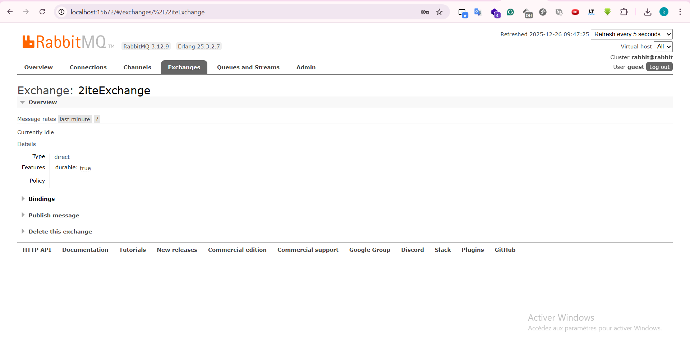

## Étape 2 — Télécharger l'image
```bash
docker pull rabbitmq:3.12.9-management
```
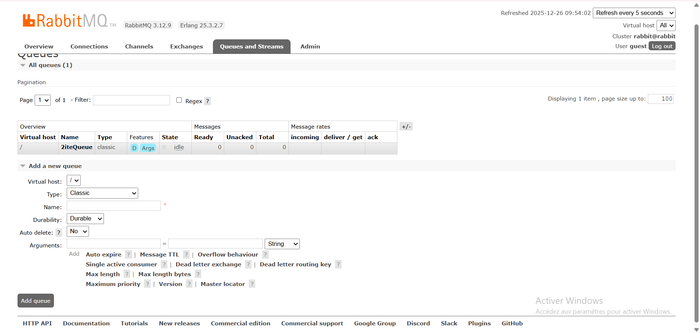

## Étape 3 — Lancer le conteneur
```bash
docker run -d --hostname rabbit --name rabbit-server -p 15672:15672 -p 5672:5672 rabbitmq:3.12.9-management
```
*Port UI : 15672 | Port AMQP : 5672*

## Étape 4 — Vérification
Vérifier dans Docker Desktop que `rabbit-server` est **Running**.

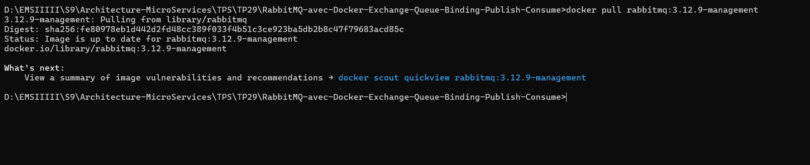

## Étape 5 — Interface Web
Accéder à [http://localhost:15672](http://localhost:15672) (Login: `guest` / `guest`).

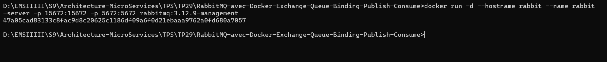

## Étape 6 — Overview
Aperçu des connexions et de l'état du nœud.

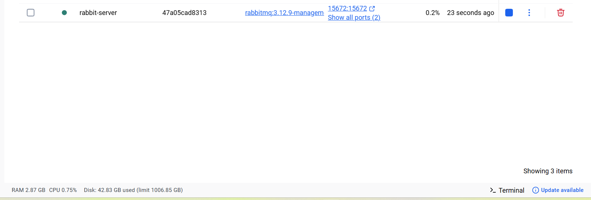
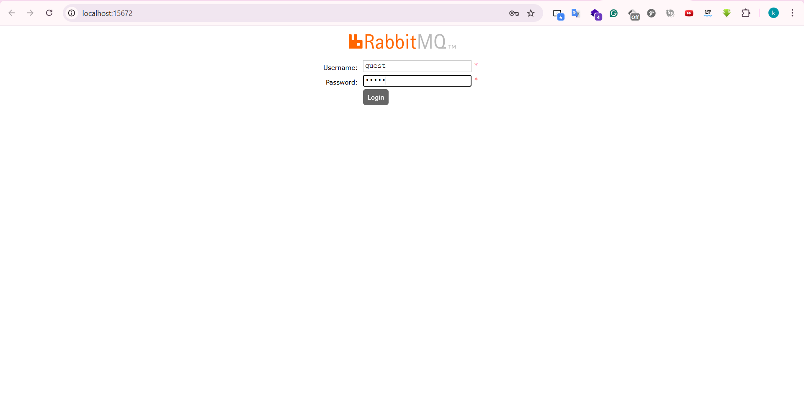

## Étape 7 — Créer Exchange
Onglet **Exchanges** > **Add a new exchange**.
*   **Name** : `2iteExchange`
*   **Type** : `direct`
*   **Durability** : `Durable`

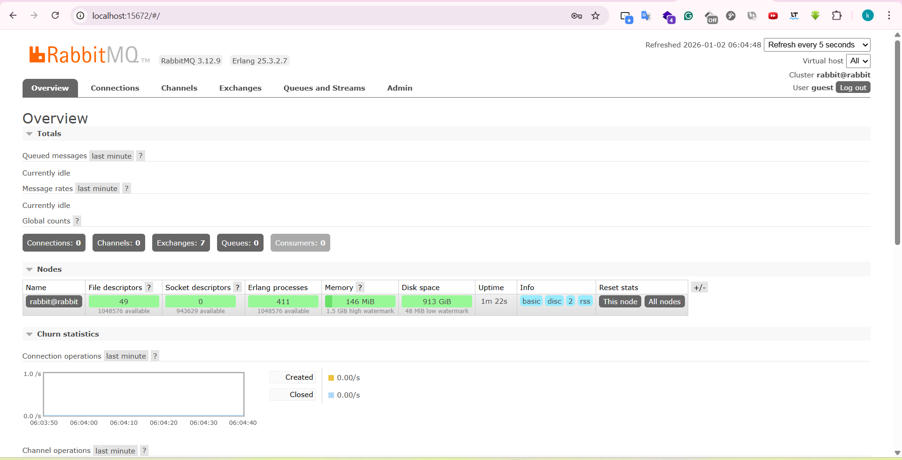

## Étape 8 — Détails Exchange
Vérifier les propriétés de `2iteExchange`.

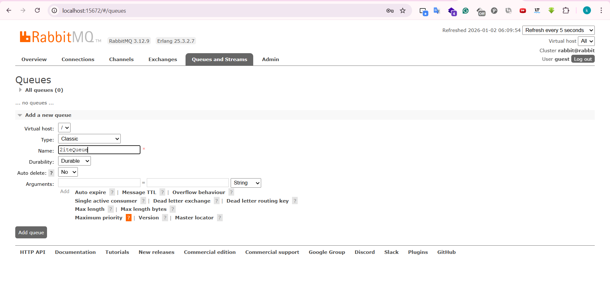

## Étape 9 — Créer Queue
Onglet **Queues** > **Add a new queue**.
*   **Name** : `2iteQueue`
*   **Type** : `Classic`

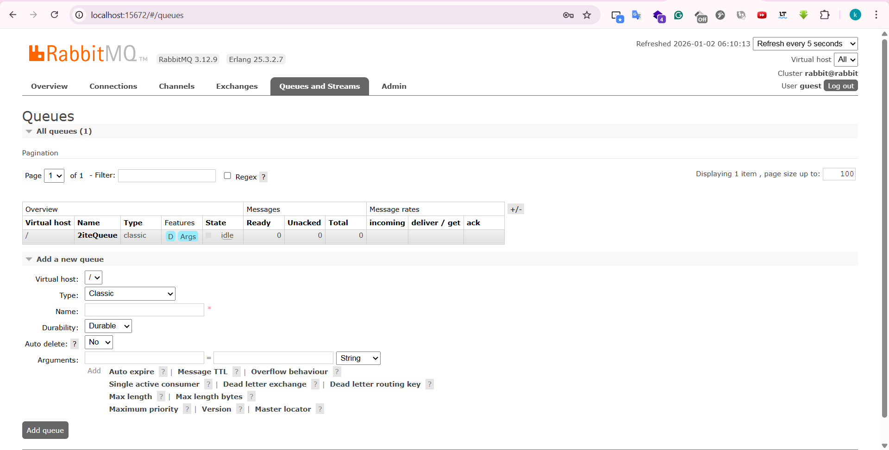

## Étape 10 — Binding
Dans **Exchanges** > `2iteExchange` > **Bindings**.
*   **To queue** : `2iteQueue`
*   **Routing key** : laisser vide.
Cliquer **Bind**.

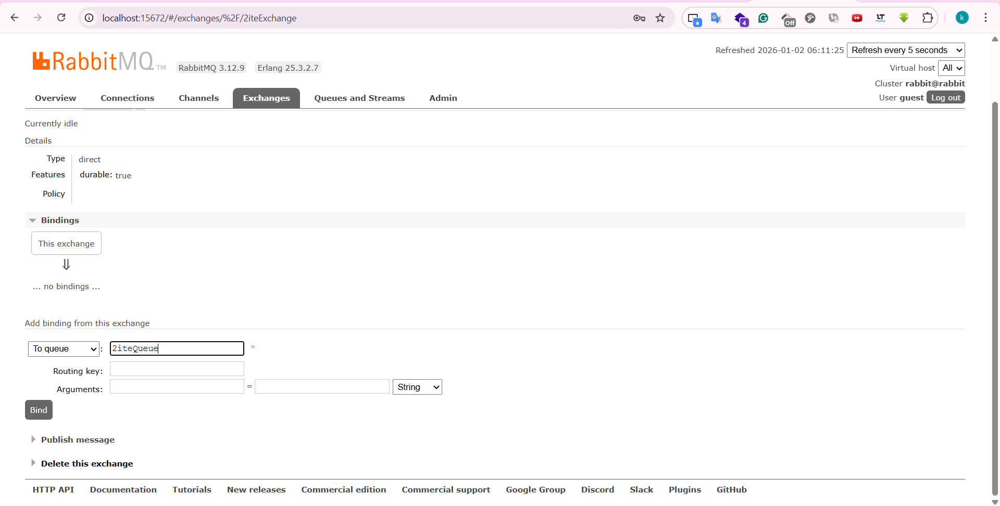
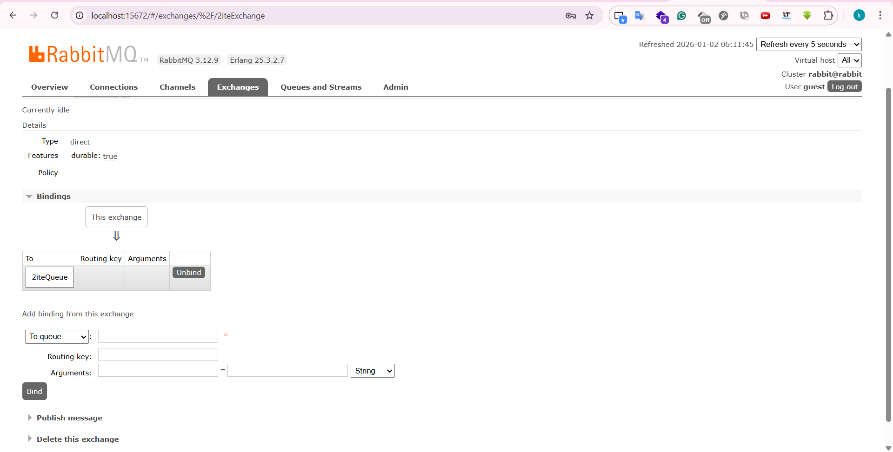

## Étape 11 — Publier un message
Dans `2iteExchange` > **Publish message**.
*   **Payload** : `Hi I'm Oussama from RabbitMQ WebUI`
Cliquer **Publish message**.

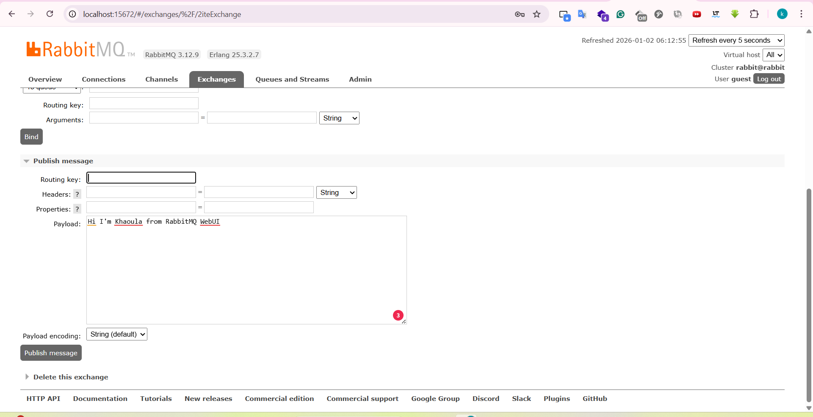
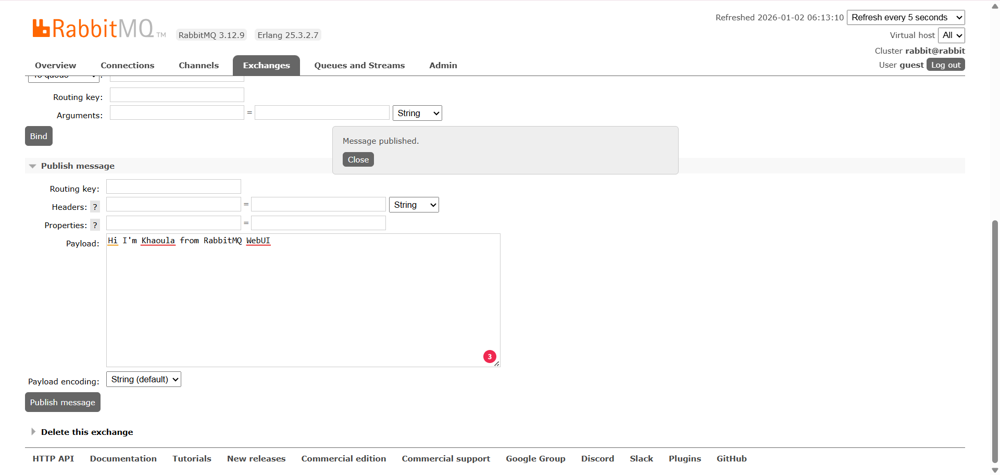

## Étape 12 — Vérification Queue
Dans **Queues** > `2iteQueue`.
Vérifier `Ready > 0`.

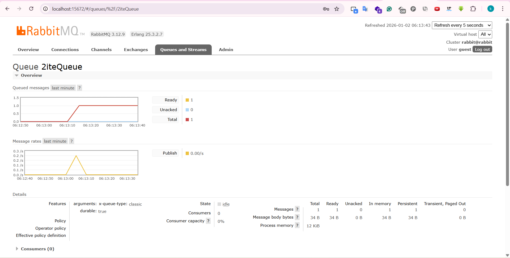

## Étape 13 — Lire le message
Dans `2iteQueue` > **Get messages**.
*   **Ack Mode** : `Nack message requeue true`
Cliquer **Get Message(s)** pour voir le payload.

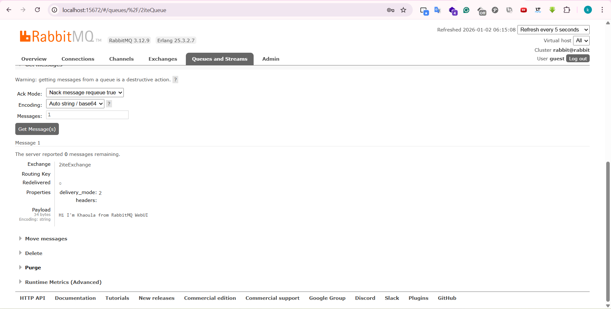